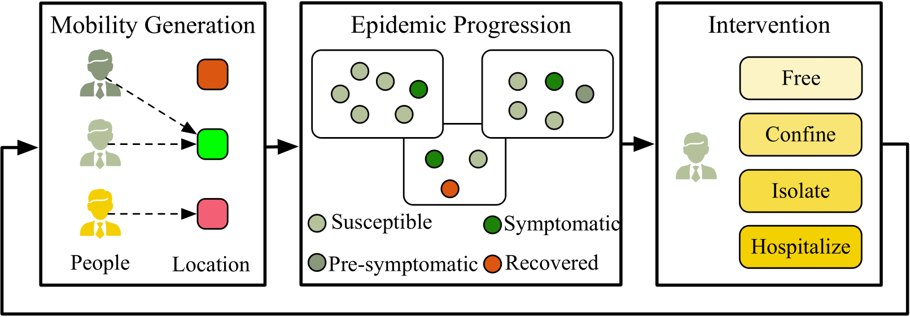

# HMES (HumanFlow)

Implementation for UIC-2022 paper "HMES: A Scalable Human Mobility and Epidemic Simulation System with Fast Intervention Modeling".

HMES is an efficient **modular** simulator supporting **large-scale** urban system with *human mobility*, *epidemic propagation*, *intervention*.    
Simulations of tens of millions of population is supported in a single simulator, and scale to billions with multiple simulators collectively.
Moreover, HMES suppports **evaluating** pandemic prvention policies on the fine-grained **individual-level**.

The Python package associated with HMES, ***humanflow***, is available for easy configuration and deployment. We hope this project could help the community with tool for understanding human mobilities and design effective pandemic prevention policies with low cost.

### The framework 
HMES is composed of a pipeline of iteratively updating mobility data, epidemic data, control policies in a loop.

<div  align="center">    

</div>


### Visualization 
Case study of COVID-19 in US (3 billion population), 180 days after out-break.

<div  align="center">    

</div>

## Cite

If you find this project helpful, please cite:


## requirements
C compiler

**pybind sync:** sync the github submodule "pybind"

```
git submodule sync    
git submodule update    
```

## compile of CXX program    
Users are recommended to run the code on Clion. Right click the project and click "Reload Cmake Project". The project will be compiled automatically. If there are any errors reported, delete compiled folders and compile again.

## Compile of python package

click "run".

```
pip3 install -e .
```

## Use of python package
Users could:
- install humanflow with command above
- or put "*.so" into the directory and import directly with:

```
import humanflow
```
We provide example package for Python 3.8 under MacOS(Intel core).


For example uses, please refer to [Jupyter](tests/python/example.ipynb)


## run experiments

run C++ implementation of HMES in ./run folder.

### config file

humanflow support customizing config file, examples shown in proto/configFile/*.json.

- config.json    
   | Parameter        | value    |  explanation  |
    | --------   | :-----   | :---- |
   |"hoursPerDay"|   "14"|  hours in each day    |
   "stepToTrack" |  "28"|  number of hours to record in historical trajectory    
   "followMallProb" | "0.5"| probability of going to rouine mall    
   "followTimeProb" |  "0.5"| probabilty of staying at each location with routine time    
   "followContactProb" | "1.0"| probability of contacting with the same people    
   "isTraceTrajectory" |  "True"| record historical placed that people visited (True for location-based methods)    
   "numContactPerMan"  |  "1000"| number of contacts for each person    
   "isTraceContact"|  "false"| whther to traced historical contacted people(True for network-based methods)    
  "manNum"|  "9999"|  total number of people    
    "locNum"| "99"| total number of locations    
    "houseLocNum"| "33"| number residential blocks in locations    
    "workLocNum"| "33"| number of business blocks in locations    
    "mallLocNum"| "33"| number of entertainment blocks in locations    
   "isSetIntervention"|  "false"| whether conduct intervention    
   "OVERLAP_RATIO"|  "0.0"| probability that people visit the same locations    
   "startIdx"| "3"| starting index of all indexing for location and people    
   "acqtGroupNum" | "2" |number of acqtance for each person     
- EpiConfig.json    
   | Parameter        | value    |  explanation  |
    | --------   | :-----   | :---- |
    "incubationHours" | "56"| hours of incubations before symptoms     
  "init_infected_num" | "10"| initial number of infected people    
  "pInfection" | "0.050"| probability of infection (listwise)    
  "pFastSIRInfection" | "0.00001"| probability of fastSIR infection    
  "pEpiFastInfection" | "0.0001"| probability of of EpiFast infection    
  "fastSIRThreshold" | "0.9"| threshold for fastSIR infection    
  "pAcqtInfection" | "0.0" | probability of infection among acqtance groups    
- InterveneConfig.json    
   | Parameter        | value    |  explanation  |
    | --------   | :-----   | :---- |
  "quarantineHours" | "5"| hours for qurantine    
  "confineHours" | "5"| hours for confine     
  "isolateHours" | "5"| hours to isolate the person    
  "treatHours" | "5"| hours of treating the patients    
  "fastTraceContact" | "True"| whether conduct fast tracing algorithm    
  "traceContactOrder" | "1" | order of contact tracing    

## Code Architecture

Consist of three modules:

  | Parameter        | value    |  explanation  |
  | --------   | :-----   | :---- |
  |mobiltity generation | utilities/utility| defines common operations
  |mobiltity generation | utilities/man and utilities/location| basic data structures
  |mobiltity generation | utilities/mobilty| builds mobility class upon above
  |epidemic propagation | engine/epidemic| epidemic propagation upon mobility
  |intervention control | engine/intervene| intervention upon above

run mobility+epidemic+intervetion in the following steps:

- build and initialize mobility class object
- build and initialize epidemic class object, and set status for intial infected seeds
- build and initialize intervetion class object
- run following for each day simulation:
    - set daily configurations, including routine period and destinations
    * update health status
    * (if do)conduct intervention by contact tracing
    * run for each timestep:
      + generate mobility for 1 step
      + conduct epidemic propagation for 1 step    

<div  align="center">    

</div>


